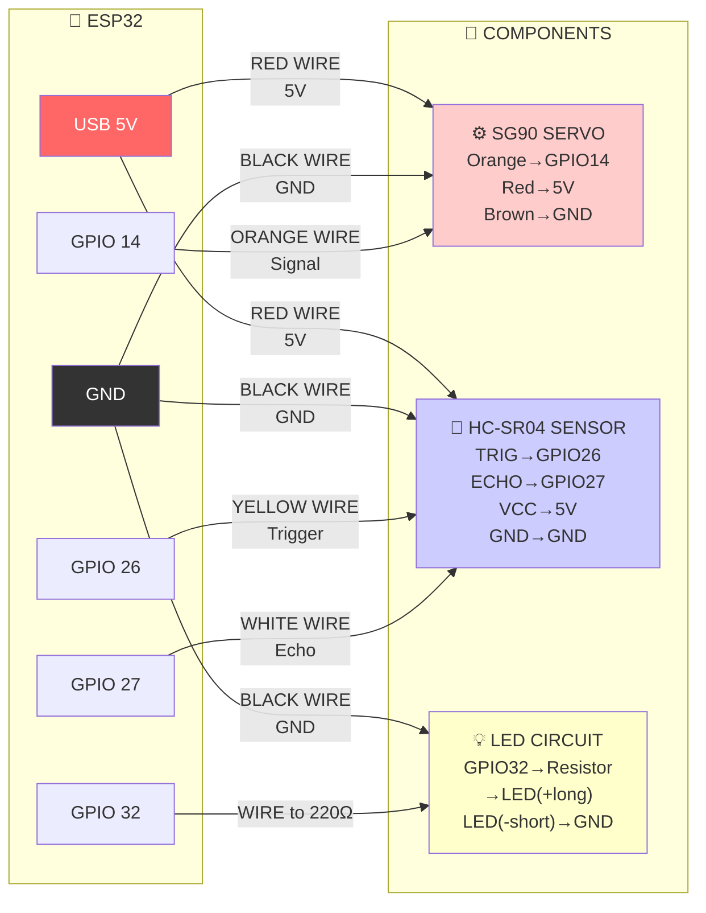

# Wiring & Components

## What You Need

| Component | Qty | Notes |
|-----------|-----|-------|
| ESP32 DevKit | 1 | WiFi-capable microcontroller |
| SG90 Servo | 1 | Blue servo motor |
| HC-SR04 Sensor | 1 | Ultrasonic distance sensor |
| 5mm LED | 1 | Red or Green |
| 220Ω Resistor | 1 | For LED current limiting |
| Breadboard | 1 | Half or full size |
| Jumper Wires | ~12 | Male-to-male connectors |
| USB Cable | 1 | USB-A to USB-C |

**Total Cost:** ₱200-400

## ⭐ MAIN WIRING DIAGRAM - FOLLOW THIS ONE



**That's it! Just follow the arrows above. Read the labels on each wire.**

## Pin Reference (If You Get Confused)

Just use the main diagram above! But here's a quick cheat sheet:

| ESP32 Pin | Wire Color | Connect To | Device |
|-----------|-----------|-----------|--------|
| **5V** | Red | VCC | Servo + Sensor |
| **GND** | Black | GND | Servo + Sensor + LED |
| **GPIO 14** | Orange | Signal | SG90 Servo |
| **GPIO 26** | Yellow | TRIG | HC-SR04 Sensor |
| **GPIO 27** | White | ECHO | HC-SR04 Sensor |
| **GPIO 32** | Any | Resistor→LED(+) | LED Alert |

**HC-SR04 Sensor (left to right):** VCC, TRIG, ECHO, GND  
**SG90 Servo:** Brown=GND, Red=5V, Orange=Signal  
**LED:** Long leg=Anode(+), Short leg=Cathode(-)

## Assembly Instructions

1. **Glue sensor to servo**
   - Hot-glue HC-SR04 to the servo horn (keep wires loose)

2. **Follow the main diagram above**
   - Red wires → 5V
   - Black wires → GND
   - Colored wires → GPIO pins (see labels)

3. **Verify before plugging in**
   - No wires touching each other
   - All GND wires connected together
   - 220Ω resistor in series with LED
   
That's it!

## Why 220Ω Resistor?

LED needs current limiting to prevent burnout.

**Calculation:**
- LED forward voltage: ~2V
- ESP32 output: 3.3V
- Maximum LED current: 20mA
- Required resistor: (3.3V - 2V) / 20mA = 65Ω minimum
- Use 220Ω for safety margin

**Do NOT skip the resistor** - LED will burn out in seconds.

## Component Specs

| Component | Voltage | Current | Notes |
|-----------|---------|---------|-------|
| ESP32 | 3.3V logic, 5V USB | 80mA | Low power at idle |
| SG90 | 4.8-6V (use 5V) | 50-100mA | Max torque at 5V |
| HC-SR04 | 5V | 15mA | Works at 3.3V but prefer 5V |
| LED | ~2V forward | 20mA | Use 220Ω resistor |
| 220Ω Resistor | Any voltage | - | ¼W power rating |

**Total Current:** ~200-250mA peak (use powered USB hub if needed)

## Testing the Wiring

**With Multimeter:**
```
1. Check 5V supply between VCC and GND → should read 5V
2. Check no shorts between signal lines
3. LED should light when power on (with resistor)
```

**With Arduino Serial Monitor:**
```
1. Flash Arduino firmware
2. Open Serial Monitor (115200 baud)
3. Should see: READY, then "angle,distance" lines
4. Servo should move, LED should light when object near
```

## Common Issues

| Problem | Cause | Fix |
|---------|-------|-----|
| LED not lighting | Wrong polarity or missing resistor | Check anode (+) to resistor, cathode (-) to GND |
| Servo not moving | GPIO 14 not connected or wrong pin | Verify orange wire to GPIO 14 |
| HC-SR04 not reading | TRIG/ECHO not connected | Check GPIO 26 (TRIG) and 27 (ECHO) |
| ESP32 resets constantly | Power issue | Use powered USB hub |
| No serial output | Firmware not uploaded | Re-upload from Arduino IDE |

That's it! Now see QUICKSTART.md to run the UI.
