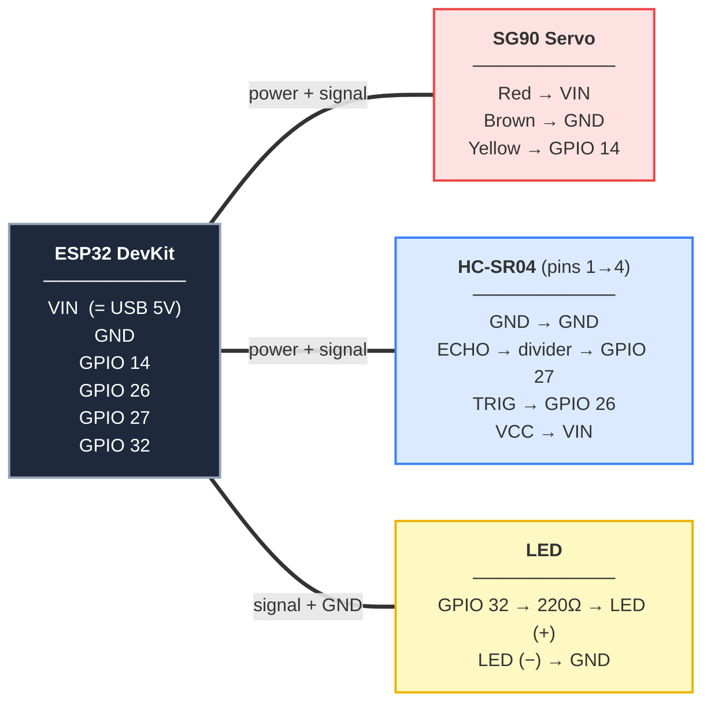

# Wiring & Components

> **Read this first — two things that matter:**
> 1. **The ESP32 DevKit has NO pin labeled "5V".** The 5V pin is labeled **`VIN`**. When the board is powered over USB, `VIN` outputs ~5V (USB pass-through). That's where the servo and sensor get their 5V.
> 2. **The HC-SR04 `ECHO` pin outputs 5V.** ESP32 GPIO pins only tolerate 3.3V. Wiring ECHO straight to a GPIO can damage the board over time. Use a **voltage divider** (two resistors) on the ECHO line. This is the one step most tutorials skip.

## What You Need

| Component | Qty | Notes |
|-----------|-----|-------|
| ESP32 DevKit V1 | 1 | Power pin is `VIN`, not `5V` |
| SG90 Servo | 1 | Blue micro servo |
| HC-SR04 Sensor | 1 | Ultrasonic distance sensor |
| 5mm LED | 1 | Red or Green |
| 220Ω resistor | 1 | LED current limiting |
| 1kΩ resistor | 1 | ECHO voltage divider (R1) |
| 2kΩ resistor | 1 | ECHO voltage divider (R2) |
| Breadboard | 1 | Half or full size |
| Jumper Wires | ~15 | Male-to-male |
| USB Cable | 1 | Powers the whole board |

> No 2kΩ? Use **2× 1kΩ in series**, or a 2.2kΩ (close enough). Goal: drop 5V to ≤3.3V.

## ⭐ Wiring Diagram — Follow This

Each part connects to the ESP32 with one clean link — no crossing wires.
Read the pin mapping inside each box.



> ⚠️ The **ECHO → divider → GPIO 27** step is not optional — see the divider diagram below.

## Connection Table

| From (ESP32) | Wire | To | Notes |
|---|---|---|---|
| `VIN` | red | SG90 red **+** HC-SR04 VCC | 5V from USB |
| `GND` | black | SG90 brown **+** HC-SR04 GND **+** LED short leg | common ground |
| `GPIO 14` | yellow | SG90 signal | 3.3V signal, SG90 accepts it |
| `GPIO 26` | — | HC-SR04 TRIG | 3.3V trigger is fine |
| `GPIO 27` | — | **ECHO via divider** | see below — do NOT connect directly |
| `GPIO 32` | — | 220Ω → LED long leg (+) | LED short leg (−) → GND |

**HC-SR04 (your board, pins 1→4):** `GND · ECHO · TRIG · VCC`. Connect by label, not
position — some other modules use `VCC · TRIG · ECHO · GND`, so always read the silkscreen.
Either way: `VCC→VIN`, `TRIG→GPIO 26`, `ECHO→divider→GPIO 27`, `GND→GND`.
**SG90 servo (your board, no labels — 3 female wires):** Brown = GND, Red = 5V (VIN),
Yellow = Signal (→ GPIO 14). On some servos the signal wire is orange instead of yellow —
it's always the third wire next to red.

## The ECHO Voltage Divider (important)

ECHO sends out 5V. Two resistors turn it into ~3.3V before it reaches GPIO 27:

```
HC-SR04 ECHO ──[ R1 = 1kΩ ]──┬──► ESP32 GPIO 27
                             │
                          [ R2 = 2kΩ ]
                             │
                            GND
```

The GPIO 27 wire taps the **junction between R1 and R2**.
Math: `5V × R2/(R1+R2) = 5V × 2/3 ≈ 3.3V`. Safe for the ESP32.

> **Shortcut (use at your own risk):** Some people power the HC-SR04 VCC from **3.3V** instead of VIN and skip the divider — at 3.3V the ECHO output is also ~3.3V. Genuine HC-SR04 modules can be unreliable at 3.3V; "HC-SR04+" / 3.3V-rated clones work fine. The divider is the robust path.

## The LED Resistor

```
GPIO 32 ──[ 220Ω ]──► LED long leg (+)
LED short leg (−) ──► GND
```

GPIO outputs 3.3V. LED drops ~2V, so the resistor sets current to about (3.3−2)/220 ≈ 6mA — safe and clearly visible. **Never wire an LED without a resistor.**

## Power Notes

- The whole board runs off the **USB cable** — no separate supply needed for a basic setup.
- The SG90 draws short current spikes when it moves. On a single small servo over USB this is usually fine; if the ESP32 **reboots when the servo moves**, power the servo from an external 5V supply and join the grounds.
- All grounds (ESP32, servo, sensor, divider, LED) must connect together.

## Test It

1. Flash the firmware (see `QUICKSTART.md` or the `flash-esp32` skill).
2. Open serial at **115200 baud** — you should see `READY` then `angle,distance` lines like `90,35.40`.
3. Servo should sweep 0°→180°; LED lights when something is within 50cm.

## Troubleshooting

| Problem | Likely cause | Fix |
|---|---|---|
| ESP32 reboots when servo moves | Servo current spike on USB | External 5V for servo, common GND |
| Distance always 0 or garbage | ECHO not divided / miswired | Check R1/R2 junction goes to GPIO 27 |
| No serial output at all | Firmware not uploaded / wrong port | Re-flash, check `ls /dev/cu.*` |
| LED never lights | Polarity or missing resistor | Long leg → resistor side, short leg → GND |
| Servo doesn't move | Signal not on GPIO 14, or no 5V on VIN | Check yellow→GPIO14, red→VIN |
| Readings noisy/jumpy | Sensor too close / loose mount | Keep >5cm, secure the sensor |

Now see `QUICKSTART.md` to run the UI.
