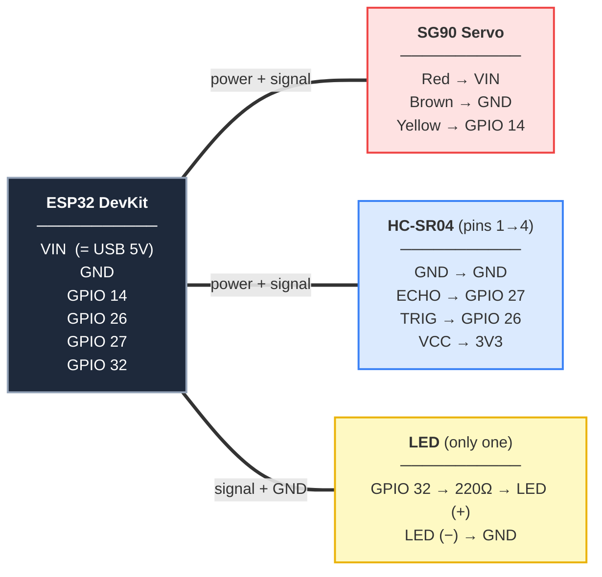

# Wiring & Components

> **Read this first:**
> 1. **The ESP32 DevKit has NO pin labeled "5V".** The 5V pin is labeled **`VIN`** (USB pass-through). There is also a separate **`3V3`** (3.3V) pin.
> 2. **Simplest build: power the HC-SR04 from `3V3`, and the only resistor you need is the 220Ω for the LED.** Powering the sensor at 3.3V means its ECHO pin also outputs ~3.3V, which is safe to wire straight into a GPIO — no voltage divider needed.
> 3. Only **one LED** in this project (alert light on GPIO 32).

## What You Need

| Component | Qty | Notes |
|-----------|-----|-------|
| ESP32 DevKit V1 | 1 | Has `VIN` (5V) and `3V3` pins |
| SG90 Servo | 1 | Micro servo (3 wires) |
| HC-SR04 Sensor | 1 | Ultrasonic distance sensor |
| 5mm LED | 1 | **One** LED — the alert light |
| 220Ω resistor | 1 | **The only resistor you need** (for the LED) |
| Breadboard | 1 | Half or full size |
| Jumper Wires | ~12 | Male-to-male |
| USB Cable | 1 | Powers the whole board |

> Optional (fallback only): a 1kΩ + 2kΩ resistor pair, **needed only if** you power the
> sensor from `VIN` (5V) instead of `3V3`. See [the fallback section](#fallback-powering-the-sensor-from-5v). Most builds skip this.

## ⭐ Wiring Diagram — Follow This

Each part connects to the ESP32 with one clean link — no crossing wires.
Read the pin mapping inside each box.



> Note: the sensor's **VCC goes to `3V3`** (not VIN). That's what lets ECHO go straight to
> GPIO 27 with no divider. The servo still uses **VIN** for power.

## Connection Table

| From (ESP32) | Wire | To | Notes |
|---|---|---|---|
| `VIN` | red | SG90 red | servo 5V power |
| `3V3` | red | HC-SR04 VCC | **sensor on 3.3V → no divider needed** |
| `GND` | black | SG90 brown **+** HC-SR04 GND **+** LED short leg | common ground |
| `GPIO 14` | yellow | SG90 signal | 3.3V signal, SG90 accepts it |
| `GPIO 26` | — | HC-SR04 TRIG | trigger |
| `GPIO 27` | — | HC-SR04 ECHO | direct — safe because sensor is on 3.3V |
| `GPIO 32` | — | 220Ω → LED long leg (+) | LED short leg (−) → GND |

**HC-SR04 (your board, pins 1→4):** `GND · ECHO · TRIG · VCC`. Connect by label, not
position — some other modules use `VCC · TRIG · ECHO · GND`, so always read the silkscreen.
Either way: `VCC→3V3`, `TRIG→GPIO 26`, `ECHO→GPIO 27`, `GND→GND`.
**SG90 servo (your board, no labels — 3 female wires):** Brown = GND, Red = 5V (VIN),
Yellow = Signal (→ GPIO 14). On some servos the signal wire is orange instead of yellow —
it's always the third wire next to red.

## The LED Resistor (the only resistor you need)

```
GPIO 32 ──[ 220Ω ]──► LED long leg (+)
LED short leg (−) ──► GND
```

GPIO outputs 3.3V. LED drops ~2V, so the resistor sets current to about (3.3−2)/220 ≈ 6mA — safe and clearly visible. **Never wire an LED without a resistor.**

## Fallback: powering the sensor from 5V

You only need this if the sensor is unreliable on 3.3V (readings stuck at 0, maxed out,
or jumpy even when wiring is correct). Move HC-SR04 **VCC from `3V3` to `VIN`** — but now
ECHO outputs 5V, so you **must** add a voltage divider before GPIO 27:

```
HC-SR04 ECHO ──[ R1 = 1kΩ ]──┬──► ESP32 GPIO 27
                             │
                          [ R2 = 2kΩ ]
                             │
                            GND
```

GPIO 27 taps the **junction between R1 and R2**. Math: `5V × 2/(1+2) ≈ 3.3V`.
No 2kΩ? Use 2× 1kΩ in series, or a 2.2kΩ. **TRIG still goes straight to GPIO 26** — only
ECHO needs the divider.

## Power Notes

- The whole board runs off the **USB cable** — no separate supply needed for a basic setup.
- The SG90 draws short current spikes when it moves. On a single small servo over USB this is usually fine; if the ESP32 **reboots when the servo moves**, power the servo from an external 5V supply and join the grounds.
- All grounds (ESP32, servo, sensor, LED) must connect together.

## Test It

1. Flash the firmware (see `QUICKSTART.md` or the `flash-esp32` skill).
2. Open serial at **115200 baud** — you should see `READY` then `angle,distance` lines like `90,35.40`.
3. Servo should sweep 0°→180°; LED lights when something is within 50cm.

## Troubleshooting

| Problem | Likely cause | Fix |
|---|---|---|
| ESP32 reboots when servo moves | Servo current spike on USB | External 5V for servo, common GND |
| Distance always 0 / maxed / jumpy | Sensor weak on 3.3V, or miswired | Verify TRIG→26, ECHO→27, VCC→3V3; if still bad, use the [5V + divider fallback](#fallback-powering-the-sensor-from-5v) |
| No serial output at all | Firmware not uploaded / wrong port | Re-flash, check `ls /dev/cu.*` |
| LED never lights | Polarity or missing resistor | Long leg → resistor side, short leg → GND |
| Servo doesn't move | Signal not on GPIO 14, or no 5V on VIN | Check yellow→GPIO14, red→VIN |

Now see `QUICKSTART.md` to run the UI.
